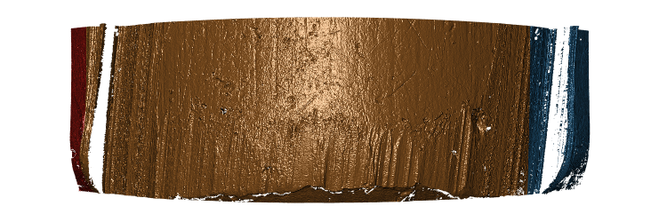
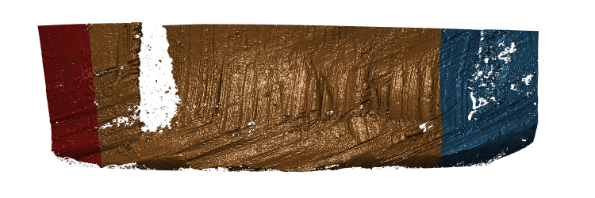

# Finding Groove Locations using Bullet Images

1. Load in Libraries

```{r}
library(grooveFinder)
library(bulletxtrctr)
library(x3ptools)
library(ggplot2)
library(dplyr)
library(readr)
library(nbtrd) # devtools::install_github("csafe-isu/nbtrd")
```

2. `grooveFinder` only works on x3p files. See package x3ptools at https://heike.github.io/x3ptools/ for ways to convert different file formats into x3p standard files. The NIST Research Ballistics Toolmarks data base (NRBTD)[https://tsapps.nist.gov/NRBTD/Studies/Search] provides access to scans of bullets and cartridge cases from various case studies.


For this tutorial we will work with 12 bullet land scans from the Hamby 252 demo set from NRBTD repository. 

```{r}
b1 <- read_bullet(urllist = hamby252demo$bullet1)
b2 <- read_bullet(urllist = hamby252demo$bullet2)
```

Combine bullet lands into a single dataframe.

```{r}
b1$bullet <- 1
b2$bullet <- 2
b1$land <- 1:6
b2$land <- 1:6
bullets <- rbind(b1, b2)
```

Convert the image units from meters to microns and rotate the scans 90 degrees so that the image is oriented properly with the heal of the bullet land at the bottom of the image.

```{r}
bullets <- bullets %>% mutate(
  x3p = x3p %>% purrr::map(.f = x3p_m_to_mum)
)

# turn the scans such that (0,0) is at the bottom left
bullets <- bullets %>% mutate(
  x3p = x3p %>% purrr::map(.f = function(x) x %>% 
                             rotate_x3p(angle = -90) %>%
                             y_flip_x3p())
) 
```

3. Methods Interlude

Before we continue estimating groove locations a discussion of the parametrization and theoretical machinery behind Hough transforms is necessary to facilitate understanding. Before groove estimates are created, the image is pre-processed by `get_grooves_hough` so that it becomes a two-dimensional gradient image to best highlight strong features. The Hough transform then loops through every pixel in the image and determines whether or not there is evidence of a line detected by comparing pixel gradients in some neighborhood. It then estimates the length and the equation of the line detected and parameterizes it using the Hesse normal form:
$$\rho = x\cos(\theta) + y \sin(\theta)$$

where $\theta$ represents the angle of the line from the positive x-axis and the $\rho$ parameter represents the length of an orthogonal vector from the origin to the line along angle the $\theta$. 

```{r, echo=FALSE}
knitr::include_graphics("images/hough_parametrization.png")
```

As such, the Hough transformation deals with the index of the pixels from the surface matrix of each x3p scan. So a conversion between pixels to microns is taken care of within the `get_grooves_hough` function. Once Hough grooves are estimated, we utilize the heuristic that grooves will often be located to the left of the lower $\frac{1}{6}^{th}$ or above the upper $\frac{5}{6}^{ths}$ of the bullet land to separate the estimated Hough lines into designated left-hand and right-hand groove estimates. 

```{r, eval = F, echo = FALSE, message=F}
library(imager)
land.x3p <- bullets$x3p[[1]]
cimg <- as.cimg(land.x3p$surface.matrix)

lsixth <- grooveFinder:::pix_to_micron(width(cimg)/6, land.x3p)
usixth <- grooveFinder:::pix_to_micron(width(cimg) * (5/6), land.x3p)
a <- bullets$x3p[[1]] %>% x3p_add_mask() %>% x3p_add_vline(xintercept = lsixth, size = 10, color = "blue") %>% x3p_add_vline(xintercept = usixth, size = 10, color = "blue")


image_x3p(a, file = "images/lower-upper-demo.png")
```

```{r, echo=FALSE}

```


We then normalize the estimated Hough transform score over the maximum possible distance for the line detected for lines that intersects with the bottom of the bullet land. The line with the highest normalized Hough score is then selected as a viable groove estimate as shown in the following tutorial. 

4. Get the ideal crosscut

For this method, we utilize the entire image of the bullet land. However we can get a better comparison between the Hough method and other methods available in `grooveFinder` by visualizing our identified method on a single crosscut. Please note, this may take some time.

```{r}
bullets <- bullets %>% mutate(
  crosscut = x3p %>% purrr::map_dbl(.f = x3p_crosscut_optimize)
)
# now extract the crosscuts
bullets <- bullets %>% mutate(
  ccdata = purrr::map2(.x = x3p, .y = crosscut, 
                       .f = x3p_crosscut)
)
```


4. Get groove locations

```{r}
bullets <- bullets %>% mutate(
  grooves_hough = ccdata %>% 
    purrr::map(.f = get_grooves_hough)
)
```
 
 Now we must apply our estimatd Hough groove fits to the ideal crosscut to get a two-dimensional visualization.
 
```{r}
bullets <- bullets %>%
  mutate(
    hough_left = purrr::map2_dbl(
      crosscut,
      grooves_hough, 
      .f = function(x, y) {
        y$left.groove.fit(x)
      }),
    hough_right = purrr::map2_dbl(
      crosscut,
      grooves_hough, 
      .f = function(x, y) {
        y$right.groove.fit(x)
      })
  )
```
 
5. Visualize grooves in two and three dimensions

First we will visualize the groove identifications on the crosscuts of the bullet lands

```{r}
profilesplus <- bullets %>% tidyr::gather(type_side, location, matches("left|right")) %>%
  tidyr::separate(type_side, into=c("type", "side")) %>%
  tidyr::unnest(ccdata)  # gets rid of all the other list variables 

profilesplus %>% 
  ggplot(aes(x = x/1000, y = value)) +
  facet_grid(bullet~land) +
  geom_line() +
  geom_vline(aes(xintercept=location/1000, colour=type), size=0.75) +
  theme_bw() +
  scale_colour_brewer(palette="Paired") +
  theme(legend.position = "bottom") +
  xlab("Relative location (in millimeters)") +
  ylab("Relative height (in microns)")

```

Now let's visualize a few bullets in three dimensions using the `get_mask_hough` function from `grooveFinder`

```{r}
land.1 <- get_mask_hough(bullets$x3p[[1]], bullets$grooves_hough[[1]])
land.6 <- get_mask_hough(bullets$x3p[[6]], bullets$grooves_hough[[6]])
```

```{r, eval = F, echo = F}
image_x3p(land.1, file = "images/good-mask.png")
image_x3p(land.6, file = "images/bad-mask.png")
```

```{r, echo=FALSE}

```

Here we have a three dimensional visualization of where the Hough transform estimates the grooves for this land. From the two dimensional visualizations it should be clear that bullet one land 6 is somewhat odd. Here we have visualizied this land in three dimensions. 

```{r, echo=FALSE}

```


The Hough estimates in this case appear to be quite bad, however the bullet land appears to have a significant amount of break-off, making estimates difficult.

