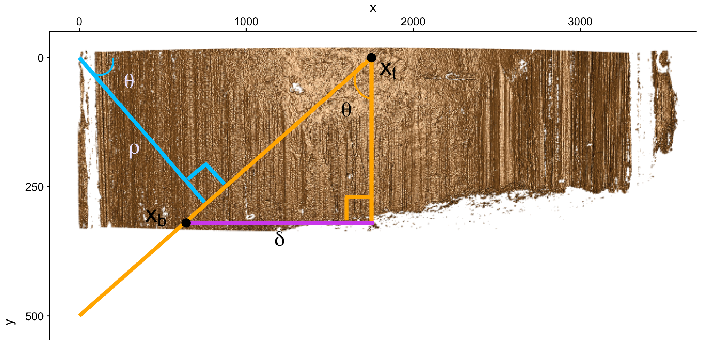
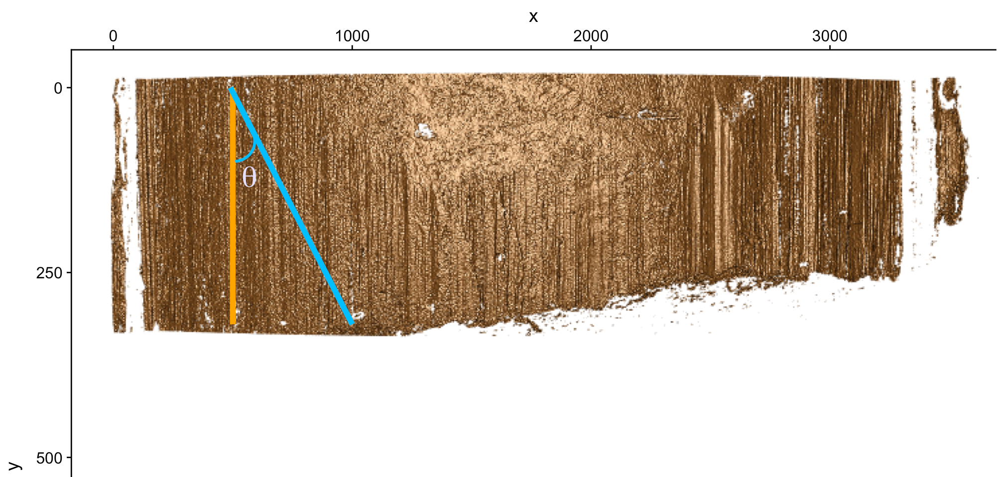
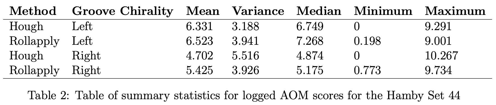

<style>

.center2 {
  margin: 0;
  position: absolute;
  top: 50%;
  left: 50%;
  -ms-transform: translate(-50%, -50%);
  transform: translate(-50%, -50%);
}

</style>
```{r, load_refs, include=FALSE, cache=FALSE}
RefManageR::BibOptions(check.entries = FALSE,
           bib.style = "authoryear",
           cite.style = "alphabetic",
           style = "markdown",
           max.names = 2,
           no.print.fields = c("urldate","file","issn","url","keywords","language","abstract"),
           hyperlink = FALSE,
           dashed = FALSE)
myBib <- RefManageR::ReadBib("references.bib", check = FALSE)
```

```{r, load-libraries, include=FALSE, cache=FALSE, message=FALSE, warning=FALSE}
library(grooveFinder)
library(x3ptools)
library(bulletxtrctr)
library(imager)
library(ggplot2)
library(raster)
library(tidyr)
library(knitr)
library(fixedpoints) # remotes::install_github("dahtah/fixedpoints")
library(grid)
library(png)
library(usethis)
library(cowplot)
library(magick)

```


#Overview

 - Motivation
 
 - Background Information
 
 - Methods

 - Results & Discussion
 
---
class: inverse, center, middle
#Motivation
---
.center2[In 2009, the National Academy of Sciences published a report (National Research Council, 2009) questioning the scientific validity of many forensic methods including firearm examination.
]

---
.center2[
```{r, echo=FALSE,eval=TRUE, fig.align='middle', out.height=300,out.width=400, fig.cap="Bullet in a stage under a confocal light microscope. The green lit area covers the scan of a LEA (land engraved area)."}
knitr::include_graphics(path = "../images/microscope-bullet.jpg")
```
]
---

# Anatomy of a Bullet Land

-  During the firing process unique defects or markings present in the barrel of a gun will be imprinted on the land engraved areas (LEAs)

-  These striations have long been used to make identifications

-  The raised shoulders in these images represent the beginnings of groove engraved areas(GEAs)


```{r, echo=FALSE,eval=TRUE, fig.align='center', out.height=250,out.width=350}
knitr::include_graphics(path = "../images/hare-bullet-anatomy-image.png")
```

.footnote[
[1] `r RefManageR::Citet(myBib,1)`
]
---

# Crosscut Example

- Current methods of groove identification reduce this problem to two-dimensions by taking a crosscut

- This can come from the selection of an optimized y-location on a bullet land or as an average across a small horizontal section of a bullet land

```{r cc-location, echo = FALSE, fig.align="center", out.width = 700, out.height = 300, dpi = 400}
knitr::include_graphics(path = "../images/crosscut-location-example.png")
```

---

# Crosscut Example Continued

```{r, crosscut-motivation, echo=FALSE, fig.align = "center", message=FALSE, warning = F, out.height=350,out.width=700, dpi = 400}
if (!file.exists("../data/ccdata.rds")) {
x3p <- read_x3p("../data/HS44 - Barrel 7 - Bullet 1 - Land 3 - Scan 1 - Sneox1 - 20x - auto light left image +20 perc. - threshold 2 - resolution 4 - Marco Yepez.x3p")
# HH: this x3p file is flipped along the y axis. The crosscut will not extract a good signature
x3p <- x3p %>% x3p_flip_y() # now it's better
# image it with 

crosscut <- x3p %>% x3p_crosscut_optimize()  

x3p %>% x3p_add_hline(yintercept=crosscut+10, size=20) %>% x3p_image(multiply = 2, zoom = 0.35, file = "/Users/charlotteroiger/Documents/GitHub/HoughGroovesPaper/images/crosscut-location-example.png")
ccdata <- x3p_crosscut(x3p)
cimg <- as.cimg(x3p$surface.matrix)
saveRDS(cimg, "../data/cimg.rds")
saveRDS(ccdata, "../data/ccdata.rds")
} else {
  ccdata <- readRDS("../data/ccdata.rds")
  cimg <- readRDS("../data/cimg.rds")
}
grooves <- cc_locate_grooves(ccdata, method = "rollapply", adjust = 30)

ccdata %>%
  ggplot(aes(x = x/1000, y = value)) + 
  geom_vline(xintercept = grooves$groove[1]/1000, colour = "darkblue") +
  geom_vline(xintercept = grooves$groove[2]/1000, colour="darkblue") +
  geom_line() +
  theme_bw() +
  ylab("Relative height measurements (in micron)") +
  xlab("Relative width measurements (in mm)")

```

---
# Groove identification and Signatures

```{r signal-motivation, echo = FALSE, warning = FALSE, message=FALSE,fig.align="center", out.height=350,out.width=700, dpi = 400}
sigs1 <- cc_get_signature(ccdata, grooves, span1 = 0.75, span2 = 0.05)
grooves.bad <- list("groove" = c(grooves$groove[1] -50, grooves$groove[2]))

sigs2 <- cc_get_signature(ccdata, grooves.bad, span1 = 0.75, span2 = 0.05)

sigs1 %>% 
  dplyr::filter(!is.na(sig),!is.na(raw_sig)) %>%
  ggplot(aes(x = x/1000)) + 
  geom_line(aes(y = raw_sig, colour = "mis-specified", linetype="raw signature" ), alpha = 0.5, data = sigs2) +
  geom_line(aes(y = sig, colour = "mis-specified", linetype="smoothed signature"),size=1, data = sigs2) +
  geom_line(aes(y = raw_sig, colour = "well-specified", linetype="raw signature"), alpha = 0.5,) +
  geom_line(aes(y = sig, colour = "well-specified", linetype="smoothed signature"), size=1) +
  scale_colour_manual("Left Groove", values = c("orange", "steelblue")) +
  scale_linetype_manual("Signature", values = c(1,2)) +
  ylim(c(-5,7.5)) +
  #xlim(c(0, 1)) +
  theme_bw() +
  ylab("Relative heigh measurement (in micron)") +
  xlab("LEA signature (in millimeters)") +
  theme(legend.position = "bottom")
```

 
---
class: inverse, center, middle
#Background

---
# Previous Applications of Edge Detection

- Chu et al. (2010)[2]: Used Edge detection to quantify the quality of striae detected in a bullet scan


- Chu et al. (2013)[3]: Used Canny Edge detection to identify areas of bullet lands where CCF[4] could be applied for bullet matching

--

- The results described in these works are not done so in enough detail to allow for replication or outsider research scrutiny

--

- And in fact the bulk of these results rely on the manual identification of groove engraved areas

.footnote[
[2] `r RefManageR::Citet(myBib,3)`
[3] `r RefManageR::Citet(myBib,4)`
[4] `r RefManageR::Citet(myBib,5)`
]
---
# Evaluation of Groove Identification

- Evaluate the accuracy of our estimates using the Area of Mis-identification(AOM) [5]


- Two signatures are created one for our Hough estimate and one for manually-identified grooves


- We can then integrate between these two signatures creating an area in $\text{microns}^2$

```{r AOM, echo = FALSE, warning = FALSE, message=FALSE,fig.align="center", out.height= 200,out.width=500, dpi = 400}
sigs1 <- cc_get_signature(ccdata, grooves, span1 = 0.75, span2 = 0.05)
grooves.bad <- list("groove" = c(grooves$groove[1] -50, grooves$groove[2]))

sigs2 <- cc_get_signature(ccdata, grooves.bad, span1 = 0.75, span2 = 0.05)

sigs.combined <- data.frame(sigs1, bad.sig =sigs2$sig)


sigs1 %>% 
  dplyr::filter(!is.na(sig),!is.na(raw_sig)) %>%
  ggplot(aes(x = x/1000)) + 
  geom_line(aes(y = raw_sig, colour = "mis-specified", linetype="raw signature" ), alpha = 0.5, data = sigs2) +
  geom_line(aes(y = sig, colour = "mis-specified", linetype="smoothed signature"),size=1, data = sigs2) +
  geom_line(aes(y = raw_sig, colour = "well-specified", linetype="raw signature"), alpha = 0.5,) +
  geom_line(aes(y = sig, colour = "well-specified", linetype="smoothed signature"), size=1) +
  geom_ribbon(data=subset(sigs.combined, 0 <= x/1000 & x/1000 <= 0.5), aes(ymin= bad.sig, ymax = sig), fill="mediumorchid2", alpha=0.5) +
  scale_colour_manual("Left Groove", values = c("orange", "steelblue")) +
  scale_linetype_manual("Signature", values = c(1,2)) +
  ylim(c(-5,7.5)) +
  #xlim(c(0, 1)) +
  theme_bw() +
  ylab("Relative heigh measurement (in micron)") +
  xlab("LEA signature (in millimeters)") +
  theme(legend.position = "bottom")
```


.footnote[
[5] `r RefManageR::Citet(myBib,7)`
]
---

# Introduction to the Hough transform

- The Hough transform is a low-level feature extraction algorithm that can detect user-specified shapes in an image


- Points that lie on a line in an image can be translated to intersecting lines in the feature space


```{r echo=FALSE,eval=TRUE,fig.align='center', out.height=300, out.width = 600}

knitr::include_graphics(path = "../images/feature-space.png")
```

---

# Introduction to the Hough transform

- The feature space can then be separated into bins that track the number of intersections in the feature space

- A large number of intersections at a particular set of features is thus indicative of a line 

- We perform the Hough transform on CImgs (cool images) which are stored in a way so that the default image extends the y-axis in a downward direction. 


```{r echo=FALSE,eval=TRUE,fig.align='center', out.height=300, out.width = 300}

knitr::include_graphics(path = "../images/accumulator2.png")
```

---
class: inverse, center, middle
# Methods

---
# Image Gradients

- To reduce the noise in our image we convert the 3-dimensional x3ps into 2-dimensional gradient images

- We then choose only the edges with a magnitude in the 99th percentile -i.e. only the very strong edges

```{r echo=FALSE,eval=TRUE,fig.align='center', out.height=300, out.width = 600}
knitr::include_graphics(path = "../images/strong-edge.png")
```

---
# Canny Edge

- We decided not to fully carry out Canny edge detection before applying the Hough transform [6]

- Canny edge detection dramatically increased our processing time and did not necessarily improve accuracy


```{r echo=FALSE,eval=TRUE,fig.align='center', out.height=300, out.width = 600}
knitr::include_graphics(path = "../images/canny-edge.png")
```

.footnote[
[6] `r RefManageR::Citet(myBib,8)`
]
---
# Hough Transform

- Once the Hough transform is applied using the `hough_lines` function from the imager package, we receive a dataframe of detected lines in Hessian Normal Form

--

- $\rho = x \ cos(\theta) \ + \ y \ sin(\theta)$

```{r hessian-graphic-inclusion, echo = FALSE, fig.align="center", message=FALSE, warning = F, out.width= "80%", fig.cap= "Example of Hessian Normal Form parametrization overlaid a bullet scan"}
knitr::include_graphics(path ='../images/hessian-example.png')

```

---
# Theta Filtering

- The default Hough lines detected have $\theta$ angles between $0$ and $2\pi$

- For ease of filtering we transform $\theta$ angles to be in the interval $-\pi$ and $\pi$.

- We typically expect most grooves to be vertical lines so we select only the Hough estimates with $\theta$ angles between $\frac{-\pi}{16}$ to $\frac{\pi}{16}$

```{r hessian-graphic-inclusion-again, echo = FALSE, fig.align="center", message=FALSE, warning = F, out.width= "60%", fig.cap= "Example of Hessian Normal Form parametrization overlaid a bullet scan"}
knitr::include_graphics(path ='../images/hessian-example.png')

```

---
#  Definitions

- $x_t$: The x-value where the Hough line intersects the top of the bullet land

--

- $x_b$: The x-value where the Hough line intersects the bottom of the bullet land

--

- $\delta$: The difference between $x_t$ and $x_b$ in the x-direction

--

- $h$: The height of the bullet land

--

- $m_y$: The slope of the detected Hough line in the y-direction

--

- $m_x$: The slope of the detected Hough line in the x-direction

```{r xbottom-graphic-inclusion-first, echo = FALSE, fig.align="center", message=FALSE, warning = F, out.width= "50%", fig.cap= "Demonstration of calculation of bottom intercept of a bullet land using SOH-CAH-TOA"}


```

---

# Calculating $x_b$

- When our detected Hough line is not perfectly vertical (i.e. $\theta \neq 0$ ) we can utilize:
    - $x_t = \frac{\rho}{\cos(\theta)}$

- Using geometric properties: $\delta = \tan(\theta)*\text{h}$. Thus $x_b$ = $x_t$ - $\delta$ 

- We can then use $x_b$ to calculate $m_y$ which is numerically more stable

```{r xbottom-graphic-inclusion, echo = FALSE, fig.align="center", message=FALSE, warning = F, out.width= "60%", fig.cap= "Demonstration of calculation of bottom intercept of a bullet land using SOH-CAH-TOA"}


```
---
# Normalized Scores

- We hypothesize that the lines with the largest "Hough score" ( $\psi$ ) are those along the grooves of our bullet land

- We choose to normalize these scores ( $\psi_{norm}$ ) before selecting the Hough line

- Theoretically longer lines detected in the image will have a larger possible maximum score ( $\psi_{max}$ ) 

```{r max-graphic-inclusion, echo = FALSE, fig.align="center", message=FALSE, warning = F, out.width= "60%", fig.cap= "Demonstration of calculation of theoretical maximum score"}


```

---
# Normalized Scores

- We calculate the largest possible theoretical score( $\psi_{max}$ ) using the following.
 
  - $\psi_{max} = \frac{h}{\cos(\theta)}$
  
- Then for each set of unique features the normalized score is given by 

  -  $\psi_{norm} = \frac{\psi}{\psi_{max}}$
  
```{r max-graphic-inclusion-2, echo = FALSE, fig.align="center", message=FALSE, warning = F, out.width= "60%", fig.cap= "Demonstration of calculation of theoretical maximum score"}


```
  
---
# Middle Fifty Heuristic

- To further specify appropriate Hough estimates, we reason that most grooves will not fall within the middle 50% of the bullet land

- In the off case that the highest normalized Hough score is within the middle 50% the groove is arbitrarily set to the middle 50% boundaries. 

```{r middle-fifty, echo = FALSE, fig.align="center", message=FALSE, warning = F, fig.height = 3, fig.cap= "Land Engraved Areas with Edges with magnitudes in the 99th percentile and middle 50 percent marked"}

dx <- imgradient(cimg, "x")
dy <- imgradient(cimg, "y")
grad.mag <- sqrt(dx^2+dy^2)

strong <- grad.mag > quantile(grad.mag, .99, na.rm = TRUE)

strong.raster <- imager:::as.data.frame.cimg(strong)


lfourth <- width(strong)/4
ufourth <- 3*width(strong)/4

ggplot()+
  geom_raster(data = strong.raster, aes(x = x, y = y, fill = value)) +
  scale_y_continuous(trans = "reverse") +
  scale_fill_manual(values = c("black", "white", "grey"))+
  coord_fixed() +
  guides(fill = FALSE) + 
  geom_vline(xintercept = lfourth, col = "green", lwd = 2)+
  geom_vline(xintercept = ufourth, col = "green", lwd = 2)
```

---
# Function Output

- The Hough transform method outputs two linear equations: the left ( $\gamma_{lh}$ ) and right-hand ( $\gamma_{rh}$ )side groove estimates

- Both functions use the y-locations of a crosscut as an input, denoted as $y_i$ 

- The output of each function is an x-location in microns 

- Each test set tends to have an optimal adjust value denoted as $\alpha$ that improve groove estimates

- Resulting in the following left hand and right hand groove estimates respectively:

- $\gamma_{lh} = (x_b -1)*r_s + m_y*y_{i} + \alpha$
-  $\gamma_{rh} = (x_b -1)*r_s + m_y*y_{i} - \alpha$

.footnote[
$r_s$ is the resolution of the x3p-scan
]

---
# Visualizing Hough Estimates

- We can visualize our Hough estimate over the entirety of a bullet land using the `get_mask_hough` function in GrooveFinder 

- This creates a coloured visual mask of the left and right side groove estimates on our x3p-scan

```{r get-mask-hough-example, echo = FALSE, fig.align="center", message=FALSE, warning = F, fig.height = 3, fig.cap= "Hough groove estimate visualized over whole of bullet land with adjust set to 120"}


```


---
class: inverse, center, middle
#Results

---
#Results

For a point of comparison we will be comparing the following methods to manually identified groove locations:

- Hough Transform Method
- Rollapply Method

The reason for this is to see how our new method of groove identification measures up to tools that are already in practice [7]

.footnote[
[7] `r RefManageR::Citet(myBib,1)`
]
---


#Imputing NAs


```{r five-percent-imputed, echo = FALSE, fig.align="center", message=FALSE, warning = F, fig.height = 3, fig.cap= "Bullet Land with missing values imputed"}

```


---
# Phoenix PD Set Density Plot

```{r phnx-density, eval = TRUE, echo = FALSE, fig.align= 'center', warning = FALSE, fig.height= 4, dpi = 300}

#load in saved results data
phoenix.df <- readRDS("../data/phoenix-rollapply-hough-scores-no-adjusts.rds")

# adjust scores to longer format so all scores are in one variable as opposed to four
phoenix.df <- phoenix.df %>%
  tidyr::pivot_longer(cols = c(score_left_hough, score_left_rollapply, score_right_hough, score_right_rollapply), names_to = "score_type", values_to = "score")

# separate scores by method and chirality
phoenix.df <- phoenix.df %>%
  dplyr::mutate(method = ifelse(score_type %in% c("score_left_hough","score_right_hough"), "hough","rollapply" ),
                groove_chirality = ifelse(score_type %in% c("score_left_hough","score_left_rollapply"), "left", "right"))

phoenix.df %>%
  dplyr::filter(score < 15000) %>%
  ggplot()+
  geom_density(aes(x = score, fill = method), alpha = 0.8) +
  scale_fill_manual(values = c("orange", "deepskyblue1")) +
  facet_wrap(~groove_chirality, nrow = 2) 
  
```

---

# Phoenix PD Set Box Plots 

```{r phnx-bw, eval = TRUE, echo = FALSE, fig.align= 'center', warning = FALSE, fig.height= 4, dpi = 300}
phoenix.df %>%
  dplyr::mutate(score = score + 1) %>%
  ggplot()+
  geom_boxplot(aes(x = log(score), fill = method), alpha = 0.8) +
  scale_fill_manual(values = c("orange", "deepskyblue1")) +
  coord_flip() +
  facet_grid(~groove_chirality) 
```

---

.center2[
```{r phoenix-table, echo = FALSE, fig.align="center", message=FALSE, warning = F, fig.height = 6}

```
]

---
# Hamby Set 44 Density Plots

```{r hamby-density, eval = TRUE, echo = FALSE, fig.align= 'center', warning = FALSE, fig.height= 4, dpi = 300}
#load in saved results data
hamby44.df <- readRDS("../data/hamby44-hough-roll-apply-score-no-adjusts.rds")

# adjust scores to longer format so all scores are in one variable as opposed to four
hamby44.df <- hamby44.df %>%
  tidyr::pivot_longer(cols = c(score_left_hough, score_left_rollapply, score_right_hough, score_right_rollapply), names_to = "score_type", values_to = "score")

# separate scores by method and chirality
hamby44.df <- hamby44.df %>%
  dplyr::mutate(method = ifelse(score_type %in% c("score_left_hough","score_right_hough"), "hough","rollapply" ),
                groove_chirality = ifelse(score_type %in% c("score_left_hough","score_left_rollapply"), "left", "right"))

hamby44.df %>%
  dplyr::filter(score < 15000) %>%
  ggplot()+
  geom_density(aes(x = score, fill = method), alpha = 0.8) +
  scale_fill_manual(values = c("orange", "deepskyblue1")) +
  facet_wrap(~groove_chirality, nrow = 2) 
  
```

---
# Hamby Set 44 Box plots

```{r hamby-bp, eval = TRUE, echo = FALSE, warning = FALSE, fig.align= 'center', fig.height= 4, dpi = 300}
hamby44.df %>%
  dplyr::mutate(score = score + 1) %>%
  ggplot()+
  geom_boxplot(aes(x = log(score), fill = method), alpha = 0.8) +
  scale_fill_manual(values = c("orange", "deepskyblue1")) +
  coord_flip() +
  facet_grid(~groove_chirality) 

```

---

.center2[
```{r hamby-table, echo = FALSE, fig.align="center", message=FALSE, warning = F, fig.height = 6}

```
]


---
# Conclusion

- Overall, the Hough transform yields a slight improvement in groove identification over previously established methods

--

- This improvement however varies slightly depending on which groove is under consideration

--

- AOM scores tend to be slightly biased in favour of the rollapply method

--

- The merits of the Hough method lie in its simplicity and ability to use information from the entirety of the bullet land

---
class: inverse, center, middle
#Questions?


---
# References
```{r refs1, echo=FALSE, results="asis"}
RefManageR::PrintBibliography(myBib)
```

